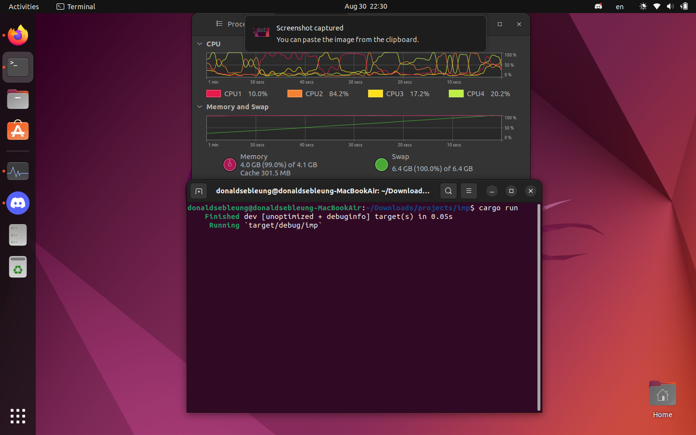

## leaky

A demo program based on code examples in chapter 15 of the book, that deliberately leaks memory by creating reference cycles in an infinite loop

### Usage

**WARNING: RUNNING THIS PROGRAM MAY CAUSE YOUR COMPUTER TO LOCK UP AND REQUIRE A HARD REBOOT!!! DO NOT RUN THIS WHILE PERFORMING SYSTEM UPDATES OR IF YOU HAVE UNSAVED WORK!!!**

Preferably in a throwaway virtual machine (VM) so your computer does not become unresponsive, build and run the project as with any other Cargo project:

```bash
$ cargo run
```

You won't see any output in the console beyond the first few lines by Cargo. However, you can inspect its effects on the system by opening:

- Task Manager (on Windows)
- Activity Monitor (on macOS)
- GNOME System Monitor, `top`, or a comparable resource monitoring program (on Linux)

If you inspect the memory in use by programs on the system, you'll see it growing - _fast_! Eventually, all the memory on the system will be used up, and your VM (or computer, if you did not take the suggestion above to run it in a VM) will become unresponsive, requiring a forceful shutdown, or if your operating system (OS) knows to kill applications before they lock up the system, `leaky` (or perhaps some other application!) will be killed, which you can see from the console output:

```
Killed
```

This demonstrates, in a direct and rather catastrophic manner, that Rust does not prevent memory leaks despite its memory safety guarantees, and the potential real-world consequences of such a memory leak.

### Demo

`leaky` eating up memory and swap space on my Ubuntu 22.04 box, seconds before being killed by the system:


